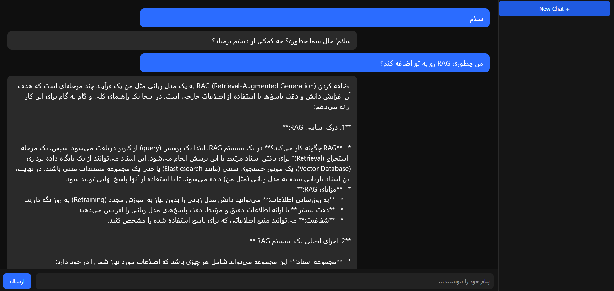

### PersianLLM
A lightweight Persian Large Language Model chat interface built with FastAPI, Ollama, and modern streaming UI similar to ChatGPT.

This project provides a simple infrastructure for interacting with local LLMs (such as Gemma) while supporting Persian language conversations. It is designed as a starting point for building research tools, Persian AI assistants, and RAG-based systems.



### Features
FastAPI backend (high‑performance async API)
Integration with Ollama for running local LLMs
Streaming responses (token-by-token output)
Clean ChatGPT‑style UI
Persian language support (RTL interface)
Simple and extensible architecture for research projects
Demo Architecture
User → Web UI → FastAPI → Ollama → Local LLM (Gemma / other models)

The frontend sends prompts to the FastAPI server, which forwards them to Ollama. The response is streamed back to the browser in real time.

### Installation
1. Clone the repository
```
git clone https://github.com/MohammadHeydari/PersianLLM.git
```
cd PersianLLM
2. Create virtual environment (recommended)
```
python -m venv venv
```
Activate it:

Linux / macOS
```
source venv/bin/activate
```
Windows
```
venv\Scripts\activate
```
3. Install dependencies

```
pip install -r requirements.txt
```
### Install Ollama
Download and install Ollama:
```
https://ollama.com
```

### Then pull the model used in this project:
```
ollama pull gemma:4b
```

You can also use other models supported by Ollama.

Running the Application
Start the FastAPI server:
```
uvicorn app.main:app --reload
```
Then open your browser:

```
http://127.0.0.1:8000
```
You will see the chat interface.

### Project Structure
```
app/
├── main.py
├── routers/
├── services/
├── core/
├── models/
```

FastAPI backend and streaming endpoint.
```
templates/index.html
```
Frontend chat interface.

### Example Use Cases
- Persian conversational AI
- Research experiments with Persian LLMs
- Local AI assistants
- Rapid prototyping for RAG systems
- Educational projects

### Roadmap
Future improvements planned for this project:

- Conversation memory
- Markdown rendering
- RAG (Retrieval Augmented Generation)
- Persian benchmark datasets
- Vector database integration (Chroma / Qdrant)
- Multi‑model support
- Docker deployment
### Contributing
Contributions are welcome. If you’d like to improve the project, feel free to open an issue or submit a pull request.